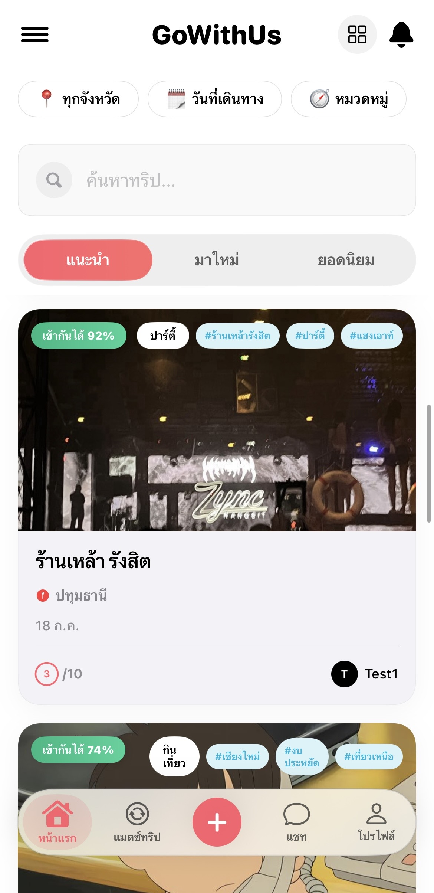
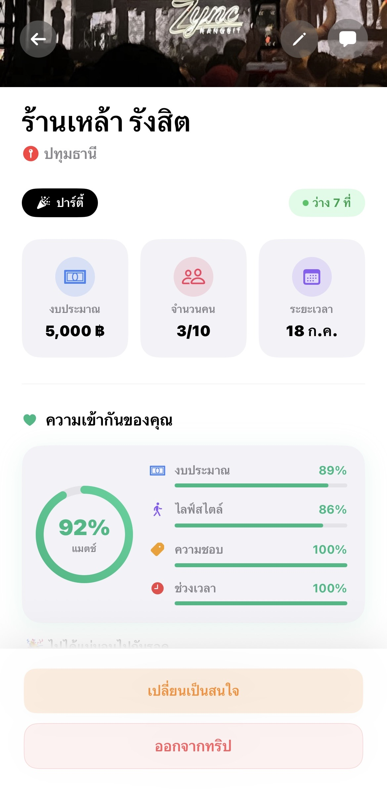
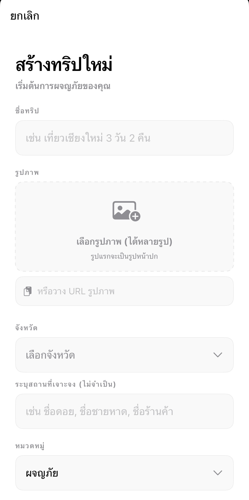
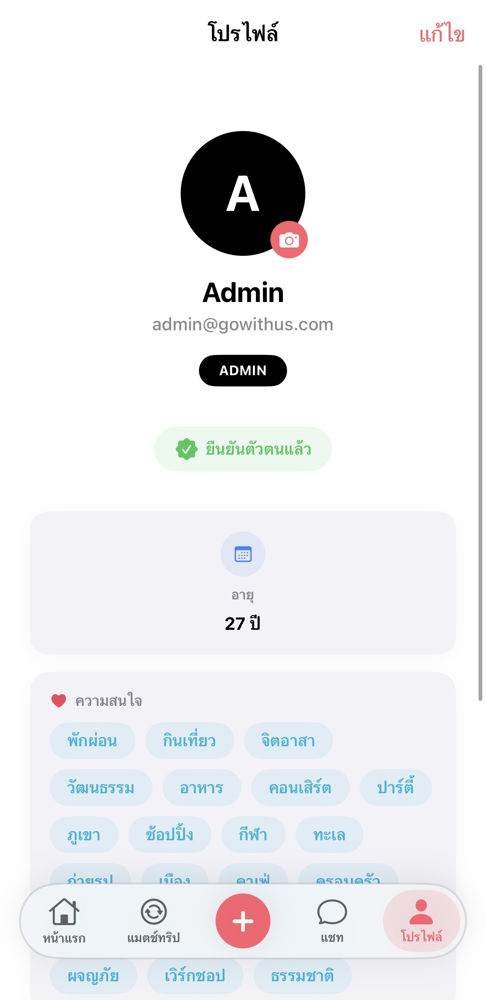

<div align="center">
  

  # ✈️ GoWithUs
  
  **A Modern, AI-Powered Travel Matching iOS Application**  
  *Find your perfect travel buddy and explore the world together.*

  <p align="center">
    <a href="#features">Features</a> • 
    <a href="#tech-stack">Tech Stack</a> • 
    <a href="#architecture">Architecture</a> • 
    <a href="#installation">Installation</a>
  </p>

  
  
  
  
  

</div>

---

## 🌟 About The Project

**GoWithUs** is a premium iOS application designed to connect travelers. Whether you're looking for a companion to split costs, share experiences, or just hang out in a new city, GoWithUs uses smart matching algorithms to find the best fit for your next adventure.

Our goal was to build not just a functional app, but a **world-class user experience**. The UI features fluid animations, glassmorphism elements, custom haptics, and a liquid-style navigation bar that feels native and alive.

---

## ✨ Key Features

- **🧠 AI Travel Matching:** Smart recommendations based on travel style, budget, and destination preferences.
- **🎨 Premium UI/UX:** Highly customized SwiftUI components, including:
  - Fluid "Jelly" Tab Bar that reacts elastically to user gestures.
  - Edge-to-edge bleed scroll views (using `safeAreaPadding`).
  - Haptic feedback engine for tactile interactions.
- **⚡ Real-time Notifications:** Instant alerts for trip updates, matches, and chat messages.
- **🛡️ Secure Authentication:** Role-based access control and secure session management.
- **🗺️ Interactive Trip Planning:** Create, discover, and join trips seamlessly.

---

## 🛠️ Tech Stack

### Frontend (iOS App)
* **Framework:** SwiftUI (iOS 17+)
* **Architecture:** MVVM (Model-View-ViewModel)
* **Design System:** Custom Design Tokens, Adaptive Dark/Light Mode (Currently locked to Light Mode for aesthetic consistency).
* **Key Libraries:** Combine for reactive state, custom `NotificationPoller` for real-time updates.

### Backend (API Server)
* **Runtime:** Node.js
* **Framework:** Express.js
* **Database:** PostgreSQL
* **ORM:** Prisma
* **Authentication:** JWT (JSON Web Tokens)

---

## 📸 Interface Highlights

| Home Feed | Trip Details | Create Trip | Profile |
| :---: | :---: | :---: | :---: |
|  |  |  |  |

---

## 🚀 Getting Started

Follow these instructions to get a copy of the project up and running on your local machine for development and testing.

### Prerequisites

- macOS with Xcode 15+
- Node.js (v18+)
- PostgreSQL installed and running

### 1. Backend Setup

```bash
# Navigate to the backend directory
cd go-with-us-backend

# Install dependencies
npm install

# Set up environment variables
cp .env.example .env

# Generate Prisma Client & Push Schema
npx prisma generate
npx prisma db push

# Start the server
npm run dev
```

### 2. iOS App Setup

1. Open `native-ios/GoWithUs.xcworkspace` in Xcode.
2. Ensure the simulator or target device is running iOS 17.0 or later.
3. Update the API Endpoint in the app's configuration to point to your local backend (`http://localhost:3000`).
4. Press `Cmd + R` to build and run the application.

---

## 💡 Technical Challenges & Solutions

- **Fluid UI Animations:** Building a liquid-style TabBar required breaking out of standard `TabView` paradigms and utilizing `.simultaneousGesture` with `GeometryReader` to track continuous finger drag, interpolating the pill's width and X-offset in real-time.
- **State Management:** Handled deeply nested state across the app using `EnvironmentObject` for global settings (like language and haptics) while keeping trip-specific data scoped to local ViewModels.

---

<div align="center">
  <p>Designed and Built with ❤️ by Worakan P.</p>
</div>
