# แผนภาพการออกแบบระบบ GoWithUs สำหรับบทที่ 3

เอกสารนี้จัดทำจากโครงสร้างที่พบในโปรเจกต์ GoWithUs โดยกำหนดขอบเขตการนำเสนอเป็นแอปพลิเคชัน iOS สำหรับผู้ใช้, Admin Backoffice, Backend API และฐานข้อมูล PostgreSQL เท่านั้น ระบบจับคู่ผู้ใช้กับผู้ใช้และเว็บสำหรับผู้ใช้ทั่วไปไม่อยู่ในขอบเขตของแผนภาพชุดนี้

## 1. System Context Diagram

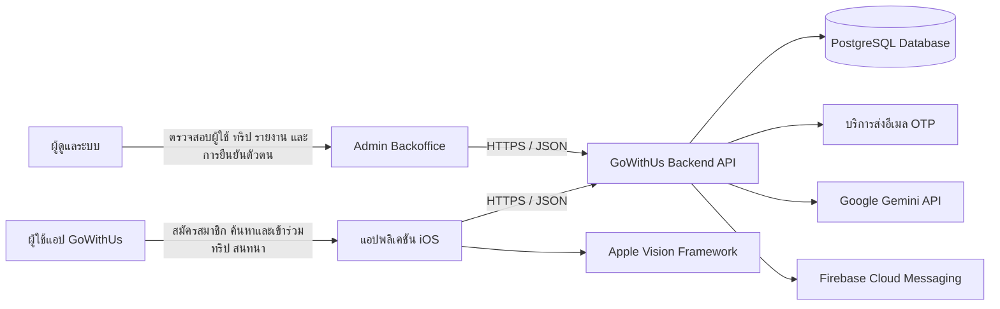

## 2. Use Case Diagram — ผู้ใช้

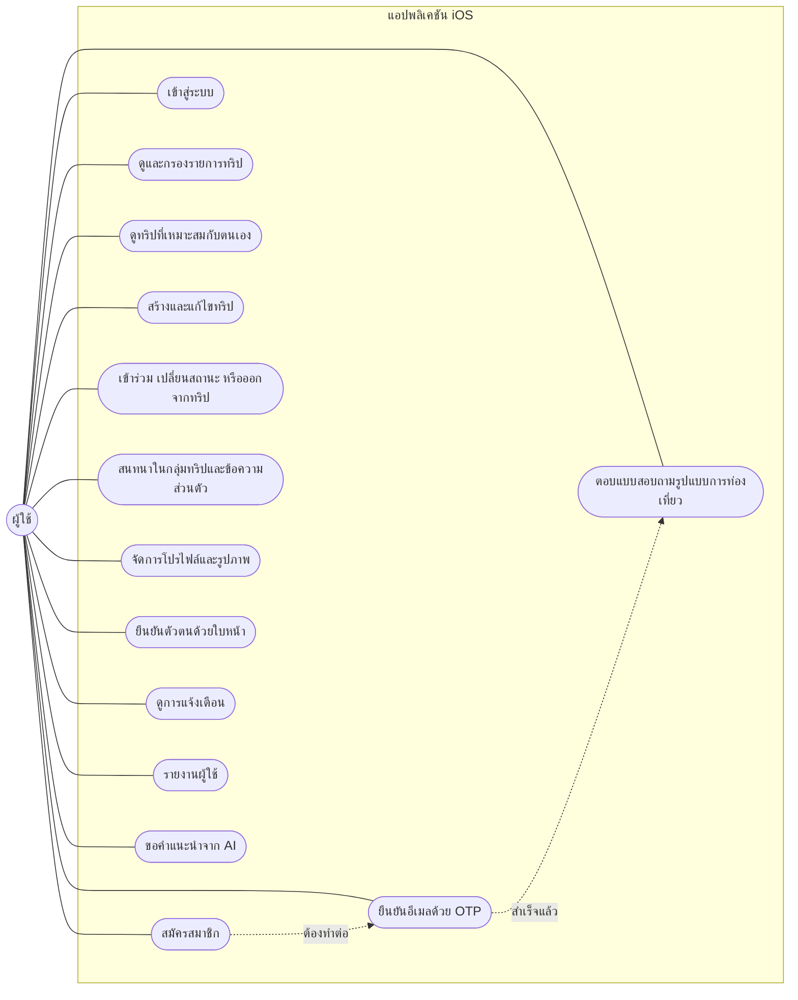

## 3. Use Case Diagram — ผู้ดูแลระบบ

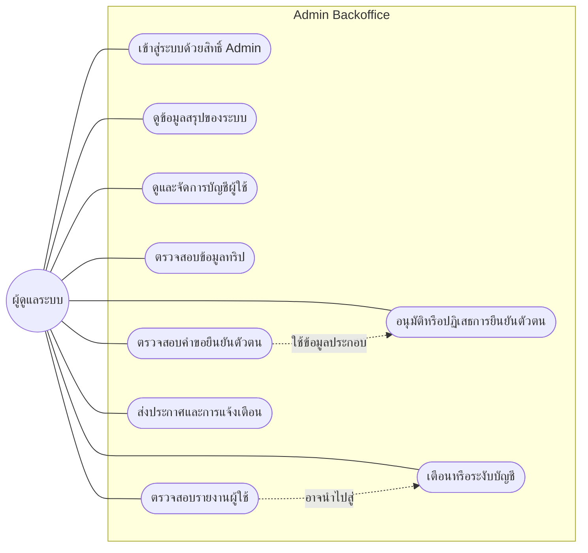

## 4. Data Flow Diagram — Context Level

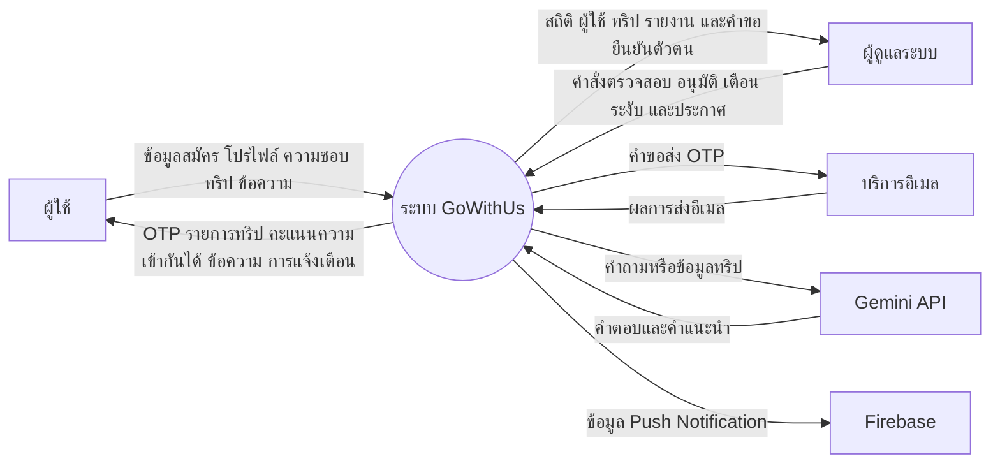

## 5. Data Flow Diagram — Level 0

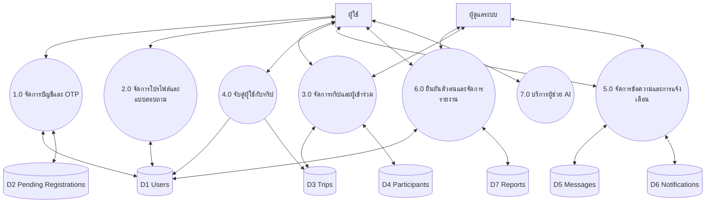

## 6. DFD Level 1 — การจับคู่ผู้ใช้กับทริป

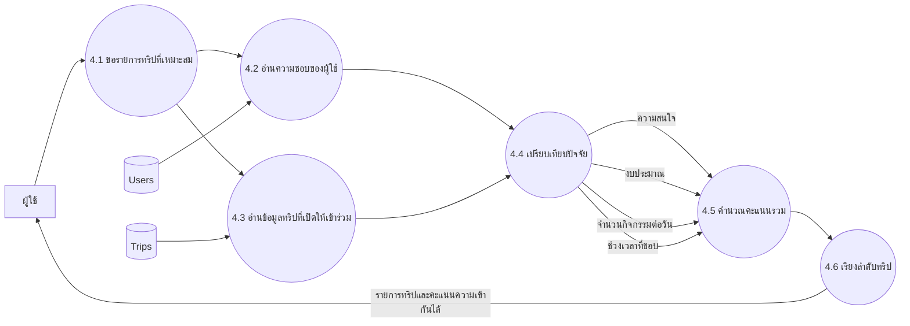

## 7. System Architecture Diagram

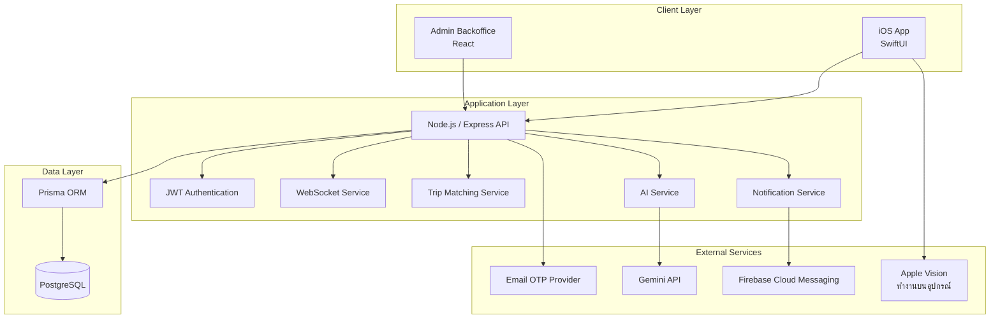

## 8. Entity Relationship Diagram

ตาราง `UserMatch` ไม่นำมาใช้ใน ER Diagram นี้ตามขอบเขตระบบที่กำหนด

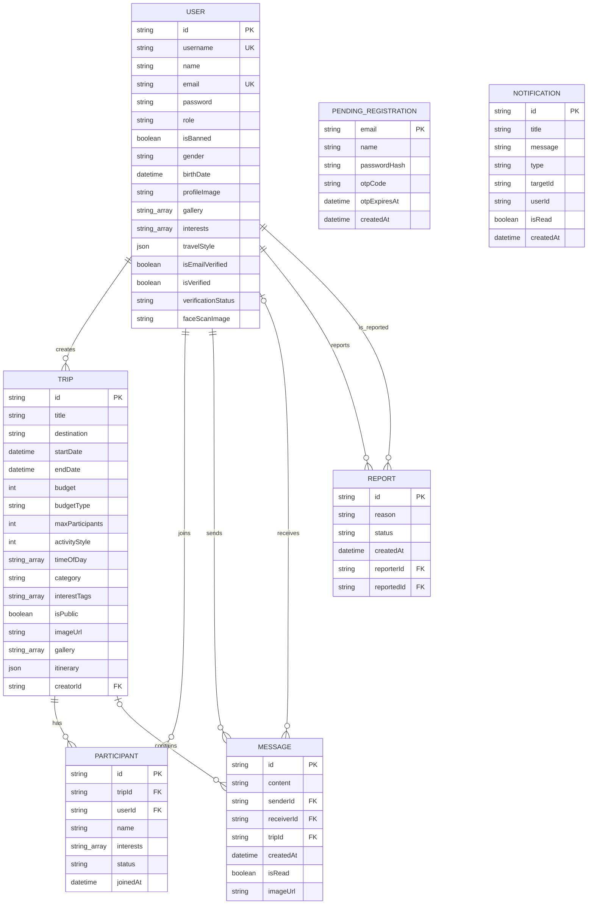

หมายเหตุ: ใน Prisma Schema ปัจจุบัน `Notification.userId` และ `Notification.targetId` เก็บเป็นค่าอ้างอิง แต่ไม่ได้ประกาศ relation โดยตรง ส่วน `PendingRegistration` เป็นพื้นที่พักข้อมูลก่อนสร้างบัญชีผู้ใช้จริงหลังยืนยัน OTP สำเร็จ

## 9. Activity Diagram — สมัครสมาชิกและยืนยัน OTP

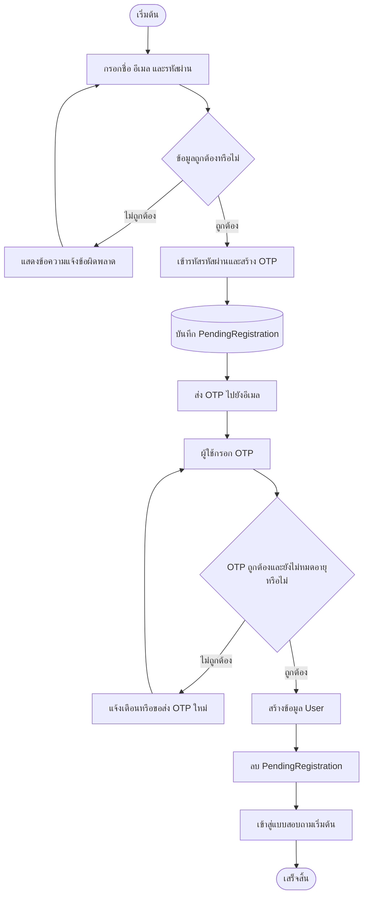

## 10. Activity Diagram — สร้างทริป

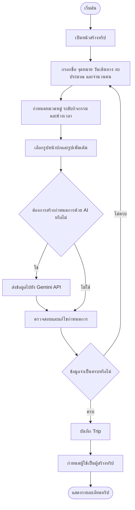

## 11. Activity Diagram — เข้าร่วมและออกจากทริป

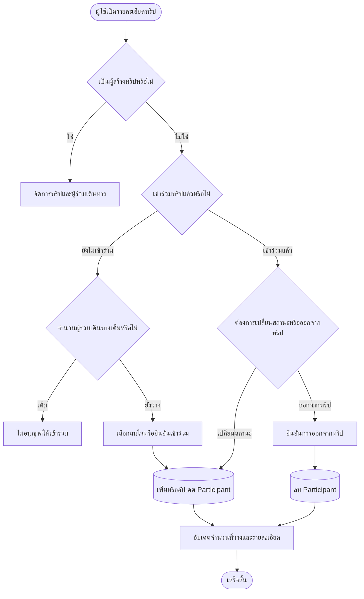

## 12. Sequence Diagram — การจับคู่ผู้ใช้กับทริป

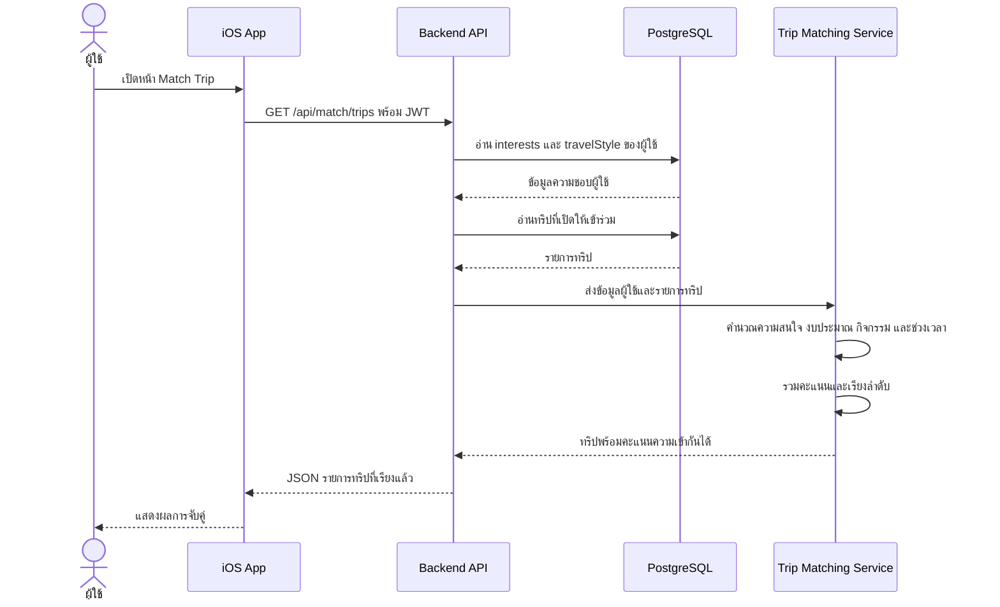

## 13. Sequence Diagram — การส่งข้อความในกลุ่มทริป

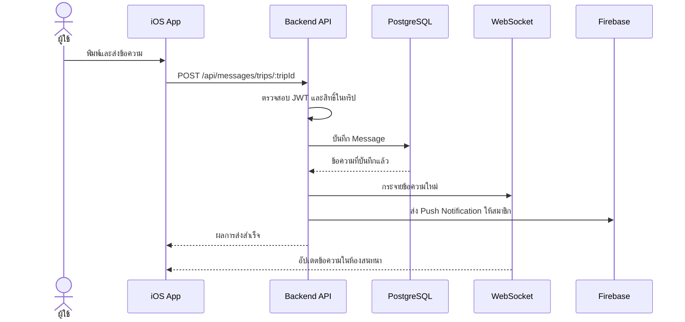

## 14. Activity Diagram — การยืนยันตัวตนด้วยใบหน้า

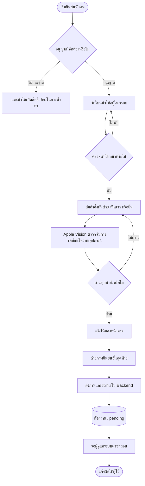

## 15. Activity Diagram — ผู้ดูแลระบบตรวจสอบรายงาน

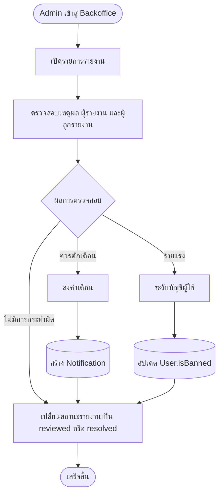

## 16. Navigation Flow — แอปพลิเคชัน iOS

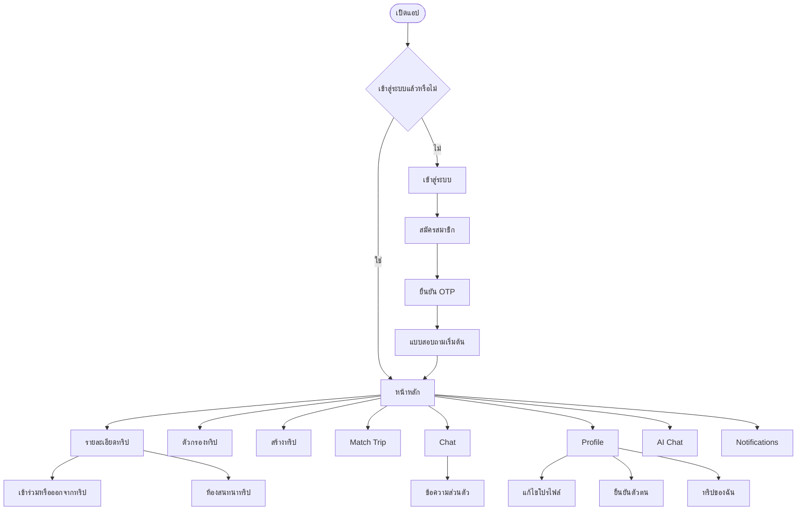

## 17. Navigation Flow — Admin Backoffice

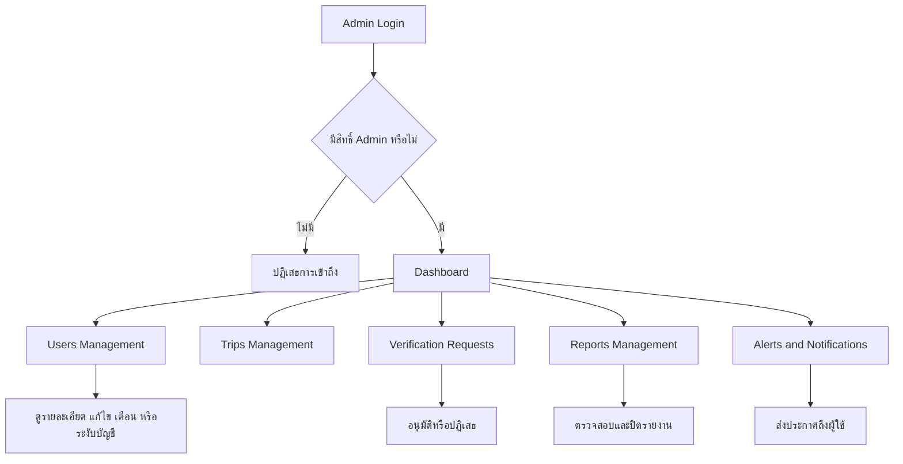

## 18. Deployment Diagram

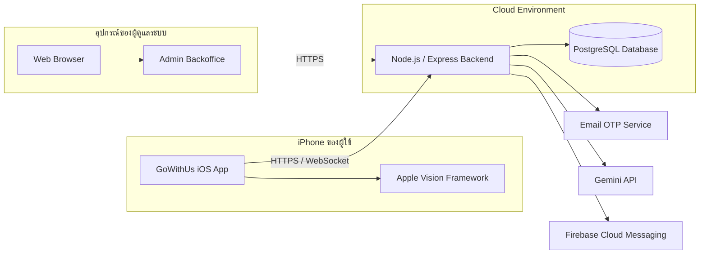

## 19. การออกแบบตารางฐานข้อมูล (Database Design)

ฐานข้อมูลของระบบใช้ PostgreSQL และจัดการโครงสร้างข้อมูลผ่าน Prisma ORM ตารางที่อยู่ในขอบเขตของระบบมีทั้งหมด 7 ตาราง โดยไม่นับตาราง `user_matches`

### 19.1 ตาราง users

ใช้เก็บบัญชีผู้ใช้ ข้อมูลโปรไฟล์ ความชอบ การตั้งค่าความเป็นส่วนตัว และสถานะการยืนยันตัวตน

| ชื่อฟิลด์ | ชนิดข้อมูล | คีย์/ข้อกำหนด | รายละเอียด |
|---|---|---|---|
| id | String (UUID) | PK | รหัสผู้ใช้ |
| username | String | Unique, Nullable | ชื่อผู้ใช้ที่ขึ้นต้นด้วย @ ในแอป |
| usernameUpdatedAt | DateTime | Nullable | วันที่เปลี่ยน username ล่าสุด |
| name | String | Required | ชื่อที่ใช้แสดง |
| email | String | Unique | อีเมลสำหรับเข้าสู่ระบบและรับ OTP |
| password | String | Required | รหัสผ่านที่ผ่านการแฮช |
| role | String | Default: user | สิทธิ์ `user` หรือ `admin` |
| isBanned | Boolean | Default: false | สถานะระงับบัญชี |
| gender | String | Nullable | เพศของผู้ใช้ |
| age | Integer | Nullable | อายุ |
| bio | Text | Nullable | คำแนะนำตัว |
| birthDate | DateTime | Nullable | วันเกิด |
| profileImage | Text | Nullable | URL หรือ Base64 ของรูปหลัก |
| gallery | String[] | Default: [] | รูปภาพเพิ่มเติมของโปรไฟล์ |
| isProfilePublic | Boolean | Default: true | อนุญาตให้ดูโปรไฟล์สาธารณะ |
| showGender | Boolean | Default: true | แสดงเพศในโปรไฟล์หรือไม่ |
| showAge | Boolean | Default: true | แสดงอายุในโปรไฟล์หรือไม่ |
| showBio | Boolean | Default: true | แสดงคำแนะนำตัวหรือไม่ |
| showInterests | Boolean | Default: true | แสดงความสนใจหรือไม่ |
| showEmail | Boolean | Default: false | แสดงอีเมลหรือไม่ |
| interests | String[] | Default: [] | หมวดหมู่ความสนใจของผู้ใช้ |
| travelStyle | JSON | Nullable | คำตอบรูปแบบการท่องเที่ยว |
| embedding | JSON | Nullable | ข้อมูลเวกเตอร์สำหรับระบบแนะนำ |
| fcmToken | String | Nullable | Token สำหรับ Push Notification |
| isEmailVerified | Boolean | Default: false | สถานะยืนยันอีเมล |
| otpCode | String | Nullable | รหัส OTP กรณีที่เกี่ยวข้องกับบัญชี |
| otpExpiresAt | DateTime | Nullable | เวลาหมดอายุของ OTP |
| isVerified | Boolean | Default: false | สถานะยืนยันตัวตน |
| verificationStatus | String | Default: unverified | `unverified`, `pending`, `verified` หรือ `rejected` |
| idCardImage | Text | Nullable | ฟิลด์รูปเอกสารยืนยันตัวตนเดิม |
| faceScanImage | Text | Nullable | รูปใบหน้าที่ส่งตรวจสอบ |
| createdAt | DateTime | Default: now | วันที่สร้างบัญชี |
| updatedAt | DateTime | Auto update | วันที่แก้ไขข้อมูลล่าสุด |

### 19.2 ตาราง pending_registrations

ใช้พักข้อมูลการสมัครก่อนยืนยัน OTP สำเร็จ เพื่อไม่สร้างบัญชีผู้ใช้จริงก่อนยืนยันอีเมล

| ชื่อฟิลด์ | ชนิดข้อมูล | คีย์/ข้อกำหนด | รายละเอียด |
|---|---|---|---|
| email | String | PK | อีเมลที่กำลังรอยืนยัน |
| name | String | Required | ชื่อที่กรอกตอนสมัคร |
| password_hash | String | Required | รหัสผ่านที่ผ่านการแฮช |
| otp_code | String | Required | รหัส OTP ที่ระบบสร้าง |
| otp_expires_at | DateTime | Required | เวลาหมดอายุของ OTP |
| created_at | DateTime | Default: now | วันที่เริ่มสมัคร |
| updated_at | DateTime | Auto update | วันที่แก้ไขข้อมูลล่าสุด |

เมื่อยืนยัน OTP สำเร็จ ระบบจะสร้างข้อมูลใน `users` และลบข้อมูลชั่วคราวรายการนี้

### 19.3 ตาราง trips

ใช้เก็บรายละเอียดทริป เงื่อนไขการเข้าร่วม ข้อมูลสำหรับ Matching รูปภาพ และกำหนดการ

| ชื่อฟิลด์ | ชนิดข้อมูล | คีย์/ข้อกำหนด | รายละเอียด |
|---|---|---|---|
| id | String (UUID) | PK | รหัสทริป |
| title | String | Required | ชื่อทริป |
| destination | String | Required, Index | จังหวัดหรือจุดหมาย |
| description | String | Nullable | รายละเอียดทริป |
| start_date | DateTime | Required | วันเริ่มเดินทาง |
| end_date | DateTime | Nullable | วันสิ้นสุดการเดินทาง |
| budget | Integer | Default: 1000 | งบประมาณหน่วยบาท |
| budget_type | String | Default: per_person | งบต่อคนหรือต่อทริป |
| max_participants | Integer | Default: 10 | จำนวนผู้ร่วมเดินทางสูงสุด |
| activity_style | Integer | Nullable, Default: 5 | ระดับจำนวนกิจกรรมต่อวัน |
| time_of_day | String[] | Default: [] | ช่วงเวลาที่มีกิจกรรม |
| budget_rating | Integer | Nullable, Default: 5 | ระดับงบประมาณสำหรับ Matching |
| category | String | Nullable, Index | หมวดหมู่หลักของทริป |
| interest_tags | String[] | Default: [] | หมวดหมู่เสริมสำหรับ Matching |
| is_public | Boolean | Default: true | สถานะเปิดเผยทริป |
| imageUrl | Text | Nullable | รูปหน้าปกทริป |
| gallery | String[] | Default: [] | รูปภาพเพิ่มเติมของทริป |
| itinerary | JSON | Nullable | กำหนดการเดินทาง |
| embedding | JSON | Nullable | เวกเตอร์สำหรับระบบแนะนำ |
| creator_id | String | FK → users.id, Index | ผู้สร้างทริป |
| summary | Text | Nullable | สรุปข้อมูลทริป |
| groupAnalysis | Text | Nullable | ผลวิเคราะห์กลุ่ม |
| created_at | DateTime | Default: now | วันที่สร้างทริป |
| updated_at | DateTime | Auto update | วันที่แก้ไขล่าสุด |

### 19.4 ตาราง participants

เป็นตารางกลางแสดงความสัมพันธ์แบบหลายต่อหลายระหว่างผู้ใช้กับทริป

| ชื่อฟิลด์ | ชนิดข้อมูล | คีย์/ข้อกำหนด | รายละเอียด |
|---|---|---|---|
| id | String (UUID) | PK | รหัสรายการเข้าร่วม |
| trip_id | String | FK → trips.id, Index | ทริปที่เข้าร่วม |
| user_id | String | FK → users.id | ผู้เข้าร่วม |
| name | String | Required | ชื่อผู้เข้าร่วม ณ เวลาบันทึก |
| interests | String[] | Required | ความสนใจของผู้เข้าร่วม |
| status | String | Default: going | `going` หรือ `interested` |
| joined_at | DateTime | Default: now | วันที่เข้าร่วม |

ข้อกำหนดสำคัญ: คู่ค่า `trip_id` และ `user_id` ต้องไม่ซ้ำ เพื่อป้องกันผู้ใช้เข้าร่วมทริปเดิมหลายครั้ง

### 19.5 ตาราง messages

ใช้ตารางเดียวรองรับทั้งข้อความในกลุ่มทริปและข้อความส่วนตัว

| ชื่อฟิลด์ | ชนิดข้อมูล | คีย์/ข้อกำหนด | รายละเอียด |
|---|---|---|---|
| id | String (UUID) | PK | รหัสข้อความ |
| content | Text | Required | เนื้อหาข้อความ |
| sender_id | String | FK → users.id, Index | ผู้ส่งข้อความ |
| receiver_id | String | FK → users.id, Nullable, Index | ผู้รับข้อความส่วนตัว |
| trip_id | String | FK → trips.id, Nullable, Index | ทริปของข้อความกลุ่ม |
| created_at | DateTime | Default: now | วันและเวลาที่ส่ง |
| is_read | Boolean | Default: false | สถานะอ่านข้อความ |
| imageUrl | Text | Nullable | รูปภาพที่แนบมากับข้อความ |

- ข้อความกลุ่มทริปใช้ `trip_id` และปล่อย `receiver_id` เป็นค่าว่าง
- ข้อความส่วนตัวใช้ `receiver_id` และปล่อย `trip_id` เป็นค่าว่าง

### 19.6 ตาราง notifications

ใช้เก็บการแจ้งเตือนเฉพาะผู้ใช้ การแจ้งเตือนเกี่ยวกับทริป และประกาศถึงผู้ใช้ทั้งหมด

| ชื่อฟิลด์ | ชนิดข้อมูล | คีย์/ข้อกำหนด | รายละเอียด |
|---|---|---|---|
| id | String (UUID) | PK | รหัสการแจ้งเตือน |
| title | String | Required | หัวข้อการแจ้งเตือน |
| message | Text | Nullable | รายละเอียดการแจ้งเตือน |
| type | String | Default: alert | `alert`, `trip` หรือ `system` |
| target_id | String | Nullable, Index | รหัสเป้าหมาย เช่น รหัสทริป |
| user_id | String | Nullable, Index | ผู้รับ; ค่าว่างหมายถึงส่งถึงผู้ใช้ทั้งหมด |
| is_read | Boolean | Default: false | สถานะอ่านแล้ว |
| created_at | DateTime | Default: now, Index | วันที่สร้างการแจ้งเตือน |

หมายเหตุ: `user_id` และ `target_id` เป็นค่าอ้างอิงเชิงตรรกะใน Schema ปัจจุบัน แต่ไม่ได้ประกาศ Foreign Key relation ผ่าน Prisma

### 19.7 ตาราง user_reports

ใช้เก็บรายงานที่ผู้ใช้ส่งให้ผู้ดูแลระบบตรวจสอบ

| ชื่อฟิลด์ | ชนิดข้อมูล | คีย์/ข้อกำหนด | รายละเอียด |
|---|---|---|---|
| id | String (UUID) | PK | รหัสรายงาน |
| reason | Text | Required | เหตุผลและรายละเอียดการรายงาน |
| status | String | Default: pending | `pending`, `reviewed` หรือ `resolved` |
| reporterId | String | FK → users.id | ผู้ส่งรายงาน |
| reportedId | String | FK → users.id | ผู้ใช้ที่ถูกรายงาน |
| createdAt | DateTime | Default: now | วันที่ส่งรายงาน |

### 19.8 สรุปความสัมพันธ์ระหว่างตาราง

| ตารางต้นทาง | ความสัมพันธ์ | ตารางปลายทาง | คีย์ที่ใช้ |
|---|---:|---|---|
| users | 1:N | trips | trips.creator_id |
| users | 1:N | participants | participants.user_id |
| trips | 1:N | participants | participants.trip_id |
| users | 1:N | messages (ผู้ส่ง) | messages.sender_id |
| users | 1:N | messages (ผู้รับ) | messages.receiver_id |
| trips | 1:N | messages | messages.trip_id |
| users | 1:N | user_reports (ผู้รายงาน) | user_reports.reporterId |
| users | 1:N | user_reports (ผู้ถูกรายงาน) | user_reports.reportedId |

ดังนั้นความสัมพันธ์ระหว่าง `users` และ `trips` ในด้านการเข้าร่วมเป็นแบบ M:N ซึ่งแยกจัดเก็บผ่านตาราง `participants` ส่วนผู้สร้างทริปเป็นความสัมพันธ์ 1:N ผ่าน `trips.creator_id`

## 20. แผนภาพการเก็บข้อมูลแบบสอบถามสำหรับ Smart Matching

คำตอบแบบสอบถามหลักไม่ได้แยกเก็บเป็นตารางแบบสอบถาม แต่บันทึกอยู่ในตาราง `users` โดยแบ่งเป็น 2 ฟิลด์ ได้แก่ `interests` และ `travelStyle` จากนั้นจึงนำไปเปรียบเทียบกับข้อมูลในตาราง `trips`

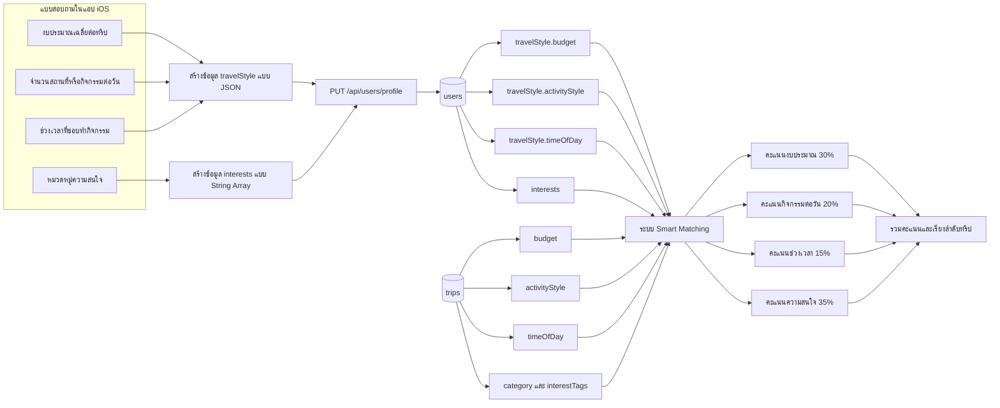

### 20.1 การเชื่อมคำถามกับฟิลด์ฐานข้อมูล

| คำถามในแบบสอบถาม | ค่าที่แอปบันทึก | ฟิลด์ใน users | ฟิลด์ของทริปที่นำมาเปรียบเทียบ |
|---|---|---|---|
| งบประมาณเฉลี่ยต่อทริป | จำนวนเงิน เช่น `1500` บาท | `travelStyle.budget` | `trips.budget` |
| จำนวนสถานที่หรือกิจกรรมต่อวัน | `2`, `5` หรือ `8` | `travelStyle.activityStyle` | `trips.activityStyle` |
| ช่วงเวลาที่ชอบทำกิจกรรม | Array เช่น `morning`, `afternoon` | `travelStyle.timeOfDay` | `trips.timeOfDay` |
| หมวดหมู่ที่สนใจ สูงสุด 5 รายการ | String Array | `users.interests` | `trips.category` และ `trips.interestTags` |

### 20.2 โครงสร้างข้อมูลที่บันทึกใน users

ตัวอย่างต่อไปนี้แสดงรูปแบบข้อมูลตาม Model ของแอป ไม่ใช่ตารางฐานข้อมูลเพิ่มเติม

```json
{
  "interests": ["ทะเล", "อาหาร", "คาเฟ่"],
  "travelStyle": {
    "budget": 1500,
    "activityStyle": 5,
    "timeOfDay": ["morning", "afternoon"]
  }
}
```

### 20.3 ลำดับการบันทึกคำตอบ

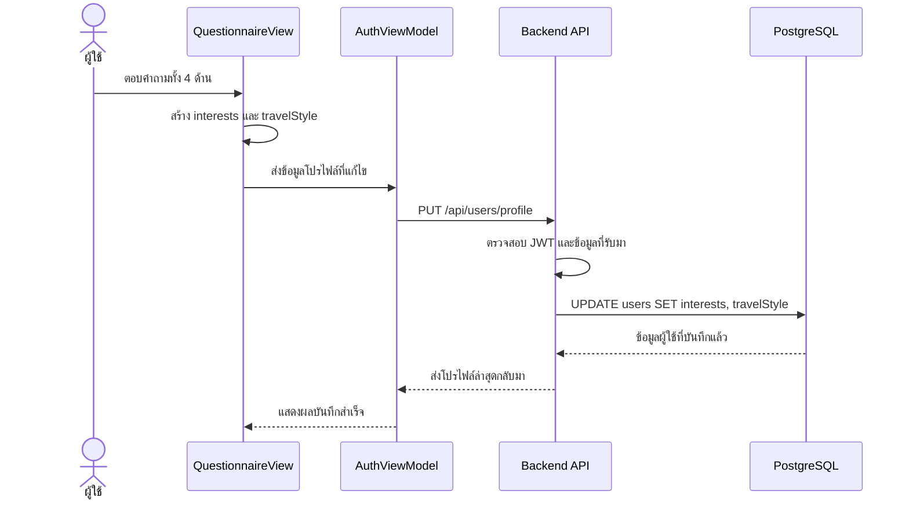

### 20.4 ข้อมูลสำคัญที่ใช้คำนวณ Matching

```mermaid
flowchart TB
    USER[(users)] --> A[interests]
    USER --> B[travelStyle.budget]
    USER --> C[travelStyle.activityStyle]
    USER --> D[travelStyle.timeOfDay]

    TRIP[(trips)] --> E[category และ interestTags]
    TRIP --> F[budget]
    TRIP --> G[activityStyle]
    TRIP --> H[timeOfDay]

    A --> I[ความสนใจ 35%]
    E --> I
    B --> J[งบประมาณ 30%]
    F --> J
    C --> K[กิจกรรมต่อวัน 20%]
    G --> K
    D --> L[ช่วงเวลา 15%]
    H --> L

    I --> TOTAL[คะแนนความเข้ากันได้ของผู้ใช้กับทริป]
    J --> TOTAL
    K --> TOTAL
    L --> TOTAL
```

## ขอบเขตที่ไม่นำเสนอ

- การค้นหาเพื่อนแบบปัดหรือ Find Buddy
- การกดถูกใจและการจับคู่ระหว่างผู้ใช้สองคน
- ตาราง `UserMatch` และ API กลุ่ม `/match/buddy`
- เว็บแอปพลิเคชันสำหรับผู้ใช้ทั่วไป

โฟลเดอร์ `web-frontend` ในซอร์สโค้ดมีไฟล์เดิมของเว็บผู้ใช้อยู่ด้วย แต่แผนภาพบทที่ 3 ชุดนี้ใช้อธิบายเฉพาะหน้า Admin Backoffice ได้แก่ Dashboard, Users, Trips, Verification, Reports และ Alerts ตามขอบเขตที่กำหนด
