# แผนภาพการออกแบบระบบ GoWithUs สำหรับบทที่ 3

เอกสารนี้จัดทำจากโครงสร้างที่พบในโปรเจกต์ GoWithUs โดยกำหนดขอบเขตการนำเสนอเป็นแอปพลิเคชัน iOS สำหรับผู้ใช้, Admin Backoffice, Backend API และฐานข้อมูล PostgreSQL เท่านั้น ระบบจับคู่ผู้ใช้กับผู้ใช้และเว็บสำหรับผู้ใช้ทั่วไปไม่อยู่ในขอบเขตของแผนภาพชุดนี้

## 1. System Context Diagram

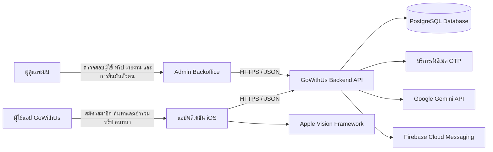

## 2. Use Case Diagram — ผู้ใช้

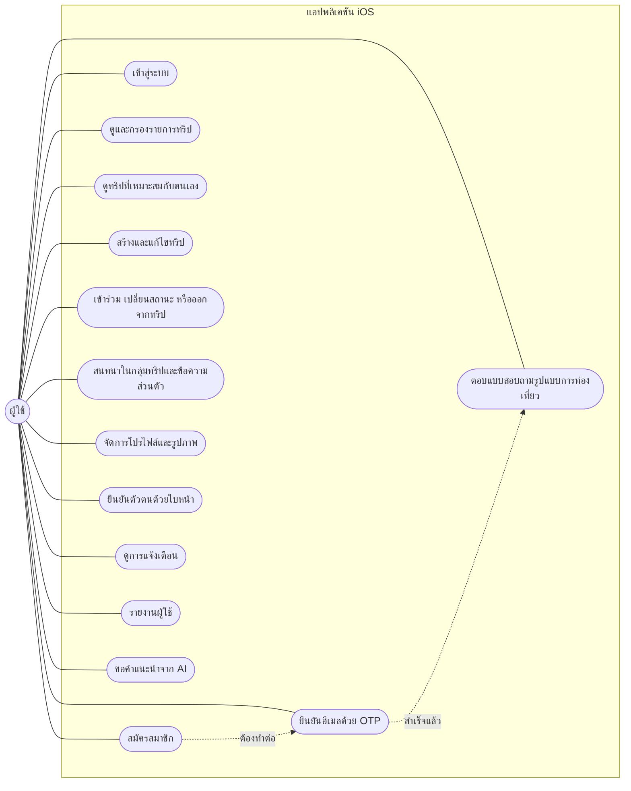

## 3. Use Case Diagram — ผู้ดูแลระบบ

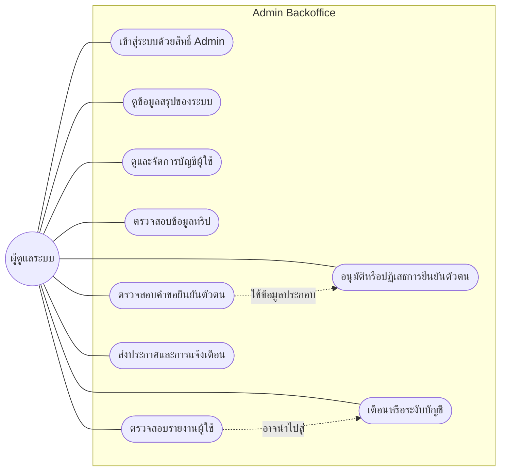

## 4. Data Flow Diagram — Context Level

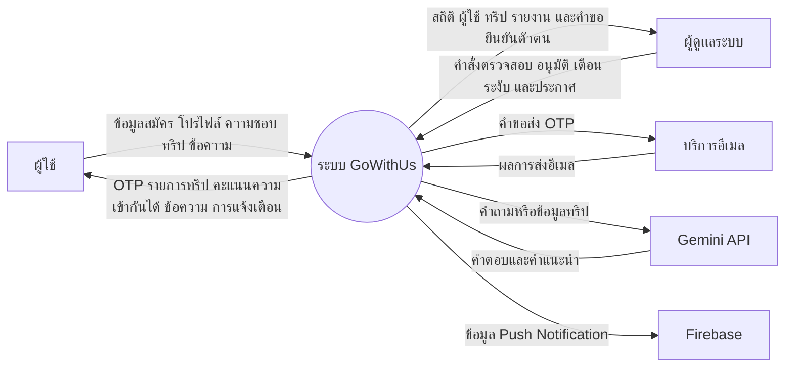

## 5. Data Flow Diagram — Level 0

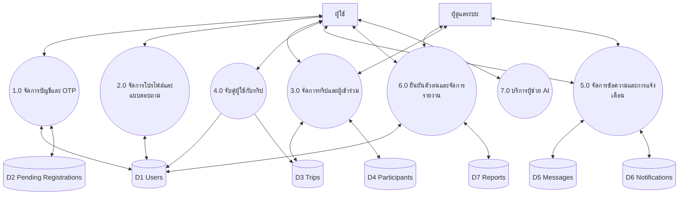

## 6. DFD Level 1 — การจับคู่ผู้ใช้กับทริป

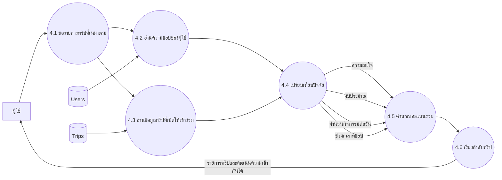

## 7. System Architecture Diagram

แผนภาพนี้เริ่มจากผู้ใช้เปิดแอป แล้วแสดงเส้นทางไปยังหน้าจอหลัก การส่งคำขอไปยัง Backend และตำแหน่งที่จัดเก็บข้อมูล โดยแบ่งสีตามหน้าที่ของระบบ

### 7.1 เส้นทางของผู้ใช้ตั้งแต่เปิดแอป

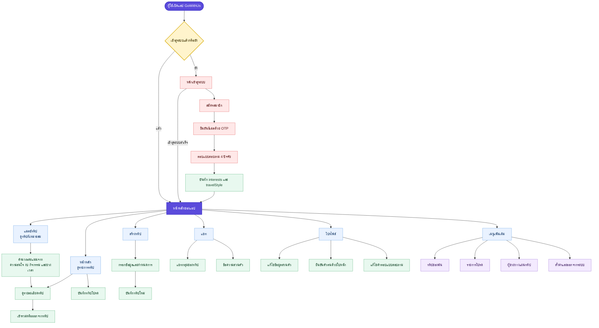

### 7.2 การเชื่อมต่อจากหน้าจอไปยังระบบหลังบ้าน

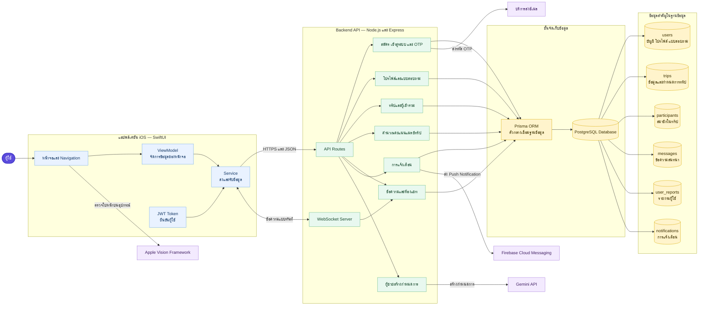

### 7.3 แผนผังการทำงานฝั่งระบบ (Activity Diagram)

แผนภาพนี้แสดงการทำงานของ Backend ตั้งแต่รับคำขอจากแอป ตรวจสอบความถูกต้อง ประมวลผลตามประเภทงาน ติดต่อฐานข้อมูล และส่งผลลัพธ์กลับไปแสดงบนหน้าจอ

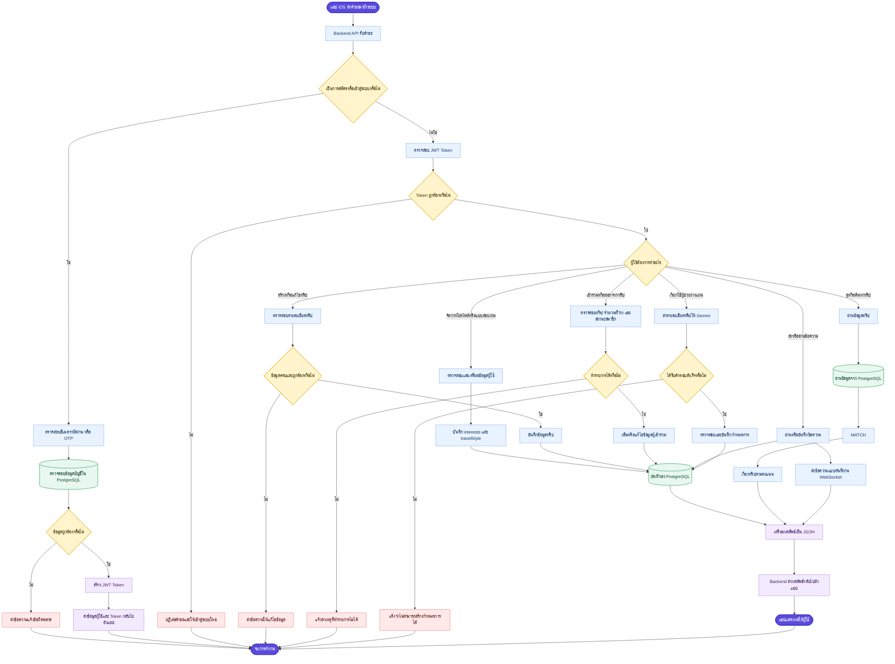

## 8. Entity Relationship Diagram

ตาราง `UserMatch` ไม่นำมาใช้ใน ER Diagram นี้ตามขอบเขตระบบที่กำหนด

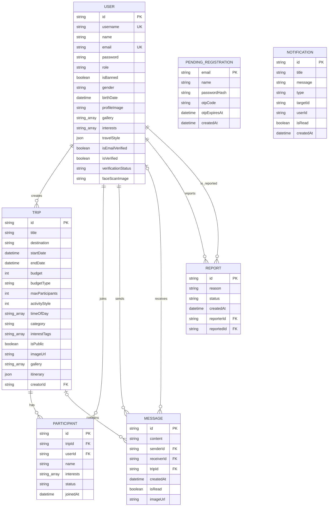

หมายเหตุ: ใน Prisma Schema ปัจจุบัน `Notification.userId` และ `Notification.targetId` เก็บเป็นค่าอ้างอิง แต่ไม่ได้ประกาศ relation โดยตรง ส่วน `PendingRegistration` เป็นพื้นที่พักข้อมูลก่อนสร้างบัญชีผู้ใช้จริงหลังยืนยัน OTP สำเร็จ

## 9. Activity Diagram — สมัครสมาชิกและยืนยัน OTP

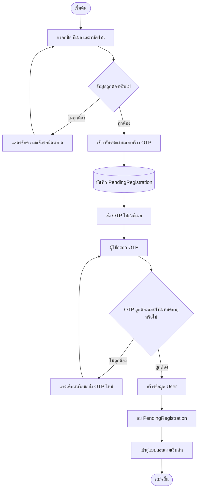

## 10. Activity Diagram — สร้างทริป

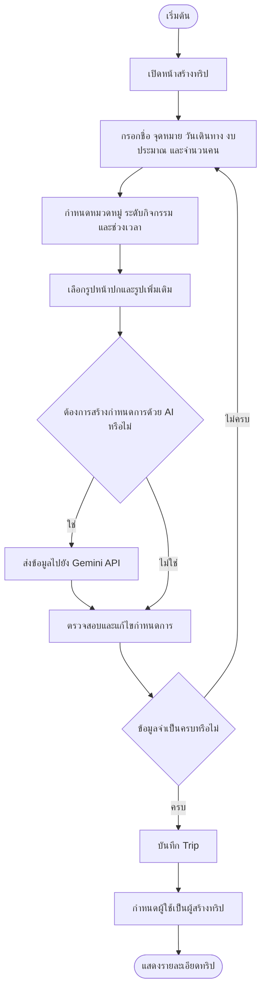

## 11. Activity Diagram — เข้าร่วมและออกจากทริป

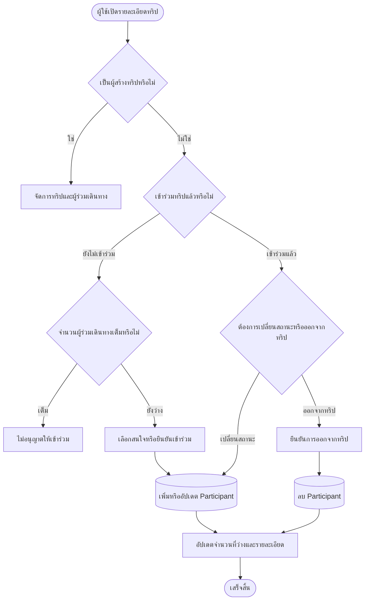

## 12. Sequence Diagram — การจับคู่ผู้ใช้กับทริป

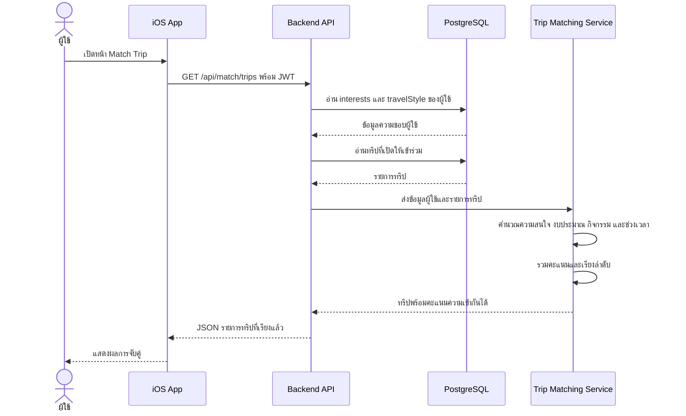

## 13. Sequence Diagram — การส่งข้อความในกลุ่มทริป

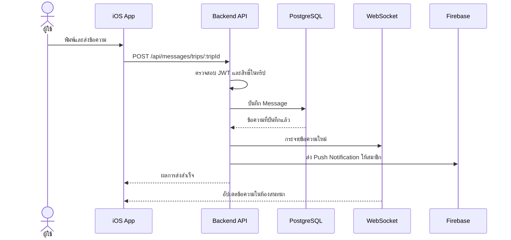

## 14. Activity Diagram — การยืนยันตัวตนด้วยใบหน้า

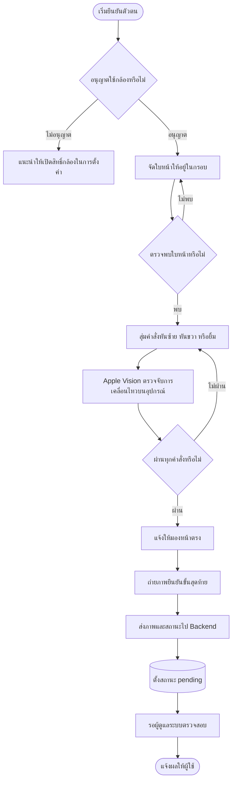

## 15. Activity Diagram — ผู้ดูแลระบบตรวจสอบรายงาน

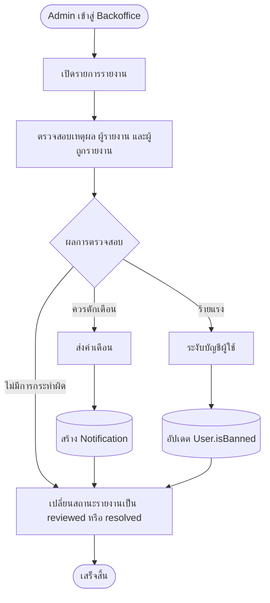

## 16. Navigation Flow — แอปพลิเคชัน iOS

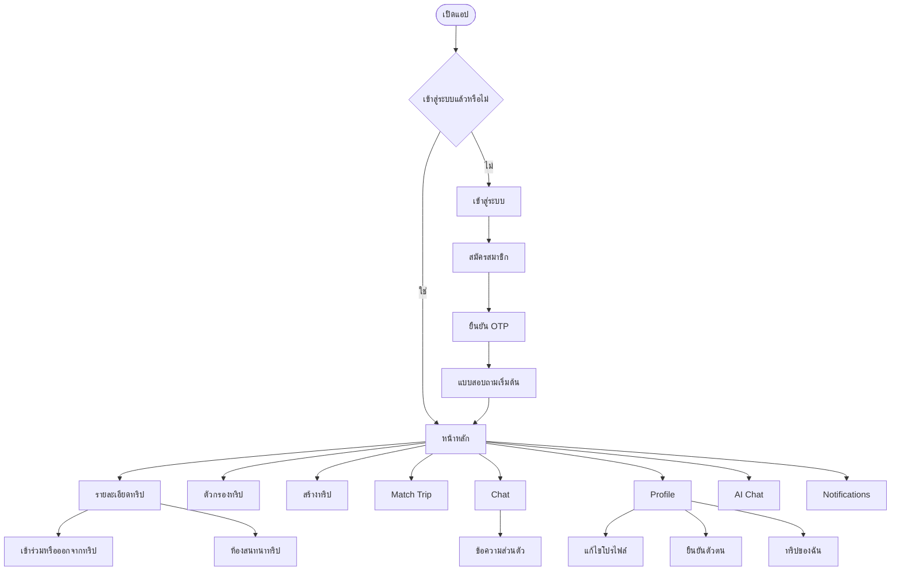

## 17. Navigation Flow — Admin Backoffice

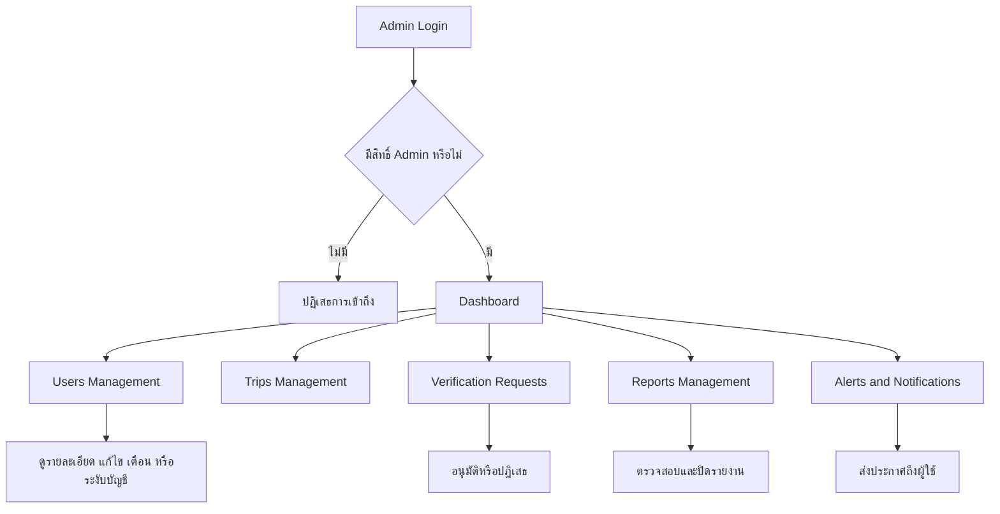

## 18. Deployment Diagram

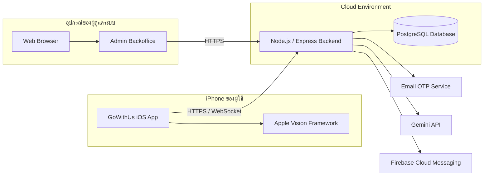

## 19. การออกแบบตารางฐานข้อมูล (Database Design)

ฐานข้อมูลของระบบใช้ PostgreSQL และจัดการโครงสร้างข้อมูลผ่าน Prisma ORM ตารางที่อยู่ในขอบเขตของระบบมีทั้งหมด 7 ตาราง โดยไม่นับตาราง `user_matches`

### 19.1 ตาราง users

ใช้เก็บบัญชีผู้ใช้ ข้อมูลโปรไฟล์ ความชอบ การตั้งค่าความเป็นส่วนตัว และสถานะการยืนยันตัวตน

| ชื่อฟิลด์ | ชนิดข้อมูล | คีย์/ข้อกำหนด | รายละเอียด |
|---|---|---|---|
| id | String (UUID) | PK | รหัสผู้ใช้ |
| username | String | Unique, Nullable | ชื่อผู้ใช้ที่ขึ้นต้นด้วย @ ในแอป |
| usernameUpdatedAt | DateTime | Nullable | วันที่เปลี่ยน username ล่าสุด |
| name | String | Required | ชื่อที่ใช้แสดง |
| email | String | Unique | อีเมลสำหรับเข้าสู่ระบบและรับ OTP |
| password | String | Required | รหัสผ่านที่ผ่านการแฮช |
| role | String | Default: user | สิทธิ์ `user` หรือ `admin` |
| isBanned | Boolean | Default: false | สถานะระงับบัญชี |
| gender | String | Nullable | เพศของผู้ใช้ |
| age | Integer | Nullable | อายุ |
| bio | Text | Nullable | คำแนะนำตัว |
| birthDate | DateTime | Nullable | วันเกิด |
| profileImage | Text | Nullable | URL หรือ Base64 ของรูปหลัก |
| gallery | String[] | Default: [] | รูปภาพเพิ่มเติมของโปรไฟล์ |
| isProfilePublic | Boolean | Default: true | อนุญาตให้ดูโปรไฟล์สาธารณะ |
| showGender | Boolean | Default: true | แสดงเพศในโปรไฟล์หรือไม่ |
| showAge | Boolean | Default: true | แสดงอายุในโปรไฟล์หรือไม่ |
| showBio | Boolean | Default: true | แสดงคำแนะนำตัวหรือไม่ |
| showInterests | Boolean | Default: true | แสดงความสนใจหรือไม่ |
| showEmail | Boolean | Default: false | แสดงอีเมลหรือไม่ |
| interests | String[] | Default: [] | หมวดหมู่ความสนใจของผู้ใช้ |
| travelStyle | JSON | Nullable | คำตอบรูปแบบการท่องเที่ยว |
| fcmToken | String | Nullable | Token สำหรับ Push Notification |
| isEmailVerified | Boolean | Default: false | สถานะยืนยันอีเมล |
| otpCode | String | Nullable | รหัส OTP กรณีที่เกี่ยวข้องกับบัญชี |
| otpExpiresAt | DateTime | Nullable | เวลาหมดอายุของ OTP |
| isVerified | Boolean | Default: false | สถานะยืนยันตัวตน |
| verificationStatus | String | Default: unverified | `unverified`, `pending`, `verified` หรือ `rejected` |
| idCardImage | Text | Nullable | ฟิลด์รูปเอกสารยืนยันตัวตนเดิม |
| faceScanImage | Text | Nullable | รูปใบหน้าที่ส่งตรวจสอบ |
| createdAt | DateTime | Default: now | วันที่สร้างบัญชี |
| updatedAt | DateTime | Auto update | วันที่แก้ไขข้อมูลล่าสุด |

#### โครงสร้างข้อมูลแบบสอบถามภายในตาราง users

ข้อมูลแบบสอบถามทั้ง 4 ปัจจัยเก็บอยู่ในตาราง `users` โดยแบ่งเป็น 2 ฟิลด์หลัก คือ `travelStyle` และ `interests` โดย `travelStyle` เป็น JSON ที่มีข้อมูลย่อย 3 ค่า ส่วนความสนใจเก็บใน `interests` แยกต่างหาก

| ฟิลด์ใน users | คีย์ย่อยภายใน JSON | ชนิดข้อมูล | ตัวอย่าง | ข้อมูลจากคำถาม |
|---|---|---|---|---|
| `travelStyle` | `budget` | Number | `1500` | งบประมาณเฉลี่ยต่อทริป |
| `travelStyle` | `activityStyle` | Number | `5` | จำนวนสถานที่หรือกิจกรรมต่อวัน |
| `travelStyle` | `timeOfDay` | String[] | `["morning", "evening"]` | ช่วงเวลาที่ชอบทำกิจกรรม |
| `interests` | ไม่อยู่ใน JSON | String[] | `["ทะเล", "อาหาร", "คาเฟ่"]` | หมวดหมู่ที่ผู้ใช้สนใจ |

```mermaid
flowchart LR
    USER[(users)] --> TS[travelStyle ชนิด JSON]
    TS --> B[budget<br/>งบประมาณ]
    TS --> A[activityStyle<br/>จำนวนกิจกรรมต่อวัน]
    TS --> T[timeOfDay<br/>ช่วงเวลาที่ชอบ]
    USER --> I[interests ชนิด String Array<br/>หมวดความสนใจ]
```

ตัวอย่างค่าที่บันทึกในผู้ใช้หนึ่งคน:

```json
{
  "interests": ["ทะเล", "อาหาร", "คาเฟ่"],
  "travelStyle": {
    "budget": 1500,
    "activityStyle": 5,
    "timeOfDay": ["morning", "evening"]
  }
}
```

ดังนั้น `budget`, `activityStyle` และ `timeOfDay` เป็นคีย์ย่อยภายในคอลัมน์ `travelStyle` ไม่ใช่คอลัมน์แยก ส่วน `interests` เป็นคอลัมน์แยกในตาราง `users`

### 19.2 ตาราง pending_registrations

ใช้พักข้อมูลการสมัครก่อนยืนยัน OTP สำเร็จ เพื่อไม่สร้างบัญชีผู้ใช้จริงก่อนยืนยันอีเมล

| ชื่อฟิลด์ | ชนิดข้อมูล | คีย์/ข้อกำหนด | รายละเอียด |
|---|---|---|---|
| email | String | PK | อีเมลที่กำลังรอยืนยัน |
| name | String | Required | ชื่อที่กรอกตอนสมัคร |
| password_hash | String | Required | รหัสผ่านที่ผ่านการแฮช |
| otp_code | String | Required | รหัส OTP ที่ระบบสร้าง |
| otp_expires_at | DateTime | Required | เวลาหมดอายุของ OTP |
| created_at | DateTime | Default: now | วันที่เริ่มสมัคร |
| updated_at | DateTime | Auto update | วันที่แก้ไขข้อมูลล่าสุด |

เมื่อยืนยัน OTP สำเร็จ ระบบจะสร้างข้อมูลใน `users` และลบข้อมูลชั่วคราวรายการนี้

### 19.3 ตาราง trips

ใช้เก็บรายละเอียดทริป เงื่อนไขการเข้าร่วม ข้อมูลสำหรับ Matching รูปภาพ และกำหนดการ

| ชื่อฟิลด์ | ชนิดข้อมูล | คีย์/ข้อกำหนด | รายละเอียด |
|---|---|---|---|
| id | String (UUID) | PK | รหัสทริป |
| title | String | Required | ชื่อทริป |
| destination | String | Required, Index | จังหวัดหรือจุดหมาย |
| description | String | Nullable | รายละเอียดทริป |
| start_date | DateTime | Required | วันเริ่มเดินทาง |
| end_date | DateTime | Nullable | วันสิ้นสุดการเดินทาง |
| budget | Integer | Default: 1000 | งบประมาณหน่วยบาท |
| budget_type | String | Default: per_person | งบต่อคนหรือต่อทริป |
| max_participants | Integer | Default: 10 | จำนวนผู้ร่วมเดินทางสูงสุด |
| activity_style | Integer | Nullable, Default: 5 | ระดับจำนวนกิจกรรมต่อวัน |
| time_of_day | String[] | Default: [] | ช่วงเวลาที่มีกิจกรรม |
| budget_rating | Integer | Nullable, Default: 5 | ระดับงบประมาณสำหรับ Matching |
| category | String | Nullable, Index | หมวดหมู่หลักของทริป |
| interest_tags | String[] | Default: [] | หมวดหมู่เสริมสำหรับ Matching |
| is_public | Boolean | Default: true | สถานะเปิดเผยทริป |
| imageUrl | Text | Nullable | รูปหน้าปกทริป |
| gallery | String[] | Default: [] | รูปภาพเพิ่มเติมของทริป |
| itinerary | JSON | Nullable | กำหนดการเดินทาง |
| creator_id | String | FK → users.id, Index | ผู้สร้างทริป |
| summary | Text | Nullable | สรุปข้อมูลทริป |
| groupAnalysis | Text | Nullable | ผลวิเคราะห์กลุ่ม |
| created_at | DateTime | Default: now | วันที่สร้างทริป |
| updated_at | DateTime | Auto update | วันที่แก้ไขล่าสุด |

### 19.4 ตาราง participants

เป็นตารางกลางแสดงความสัมพันธ์แบบหลายต่อหลายระหว่างผู้ใช้กับทริป

| ชื่อฟิลด์ | ชนิดข้อมูล | คีย์/ข้อกำหนด | รายละเอียด |
|---|---|---|---|
| id | String (UUID) | PK | รหัสรายการเข้าร่วม |
| trip_id | String | FK → trips.id, Index | ทริปที่เข้าร่วม |
| user_id | String | FK → users.id | ผู้เข้าร่วม |
| name | String | Required | ชื่อผู้เข้าร่วม ณ เวลาบันทึก |
| interests | String[] | Required | ความสนใจของผู้เข้าร่วม |
| status | String | Default: going | `going` หรือ `interested` |
| joined_at | DateTime | Default: now | วันที่เข้าร่วม |

ข้อกำหนดสำคัญ: คู่ค่า `trip_id` และ `user_id` ต้องไม่ซ้ำ เพื่อป้องกันผู้ใช้เข้าร่วมทริปเดิมหลายครั้ง

### 19.5 ตาราง messages

ใช้ตารางเดียวรองรับทั้งข้อความในกลุ่มทริปและข้อความส่วนตัว

| ชื่อฟิลด์ | ชนิดข้อมูล | คีย์/ข้อกำหนด | รายละเอียด |
|---|---|---|---|
| id | String (UUID) | PK | รหัสข้อความ |
| content | Text | Required | เนื้อหาข้อความ |
| sender_id | String | FK → users.id, Index | ผู้ส่งข้อความ |
| receiver_id | String | FK → users.id, Nullable, Index | ผู้รับข้อความส่วนตัว |
| trip_id | String | FK → trips.id, Nullable, Index | ทริปของข้อความกลุ่ม |
| created_at | DateTime | Default: now | วันและเวลาที่ส่ง |
| is_read | Boolean | Default: false | สถานะอ่านข้อความ |
| imageUrl | Text | Nullable | รูปภาพที่แนบมากับข้อความ |

- ข้อความกลุ่มทริปใช้ `trip_id` และปล่อย `receiver_id` เป็นค่าว่าง
- ข้อความส่วนตัวใช้ `receiver_id` และปล่อย `trip_id` เป็นค่าว่าง

### 19.6 ตาราง notifications

ใช้เก็บการแจ้งเตือนเฉพาะผู้ใช้ การแจ้งเตือนเกี่ยวกับทริป และประกาศถึงผู้ใช้ทั้งหมด

| ชื่อฟิลด์ | ชนิดข้อมูล | คีย์/ข้อกำหนด | รายละเอียด |
|---|---|---|---|
| id | String (UUID) | PK | รหัสการแจ้งเตือน |
| title | String | Required | หัวข้อการแจ้งเตือน |
| message | Text | Nullable | รายละเอียดการแจ้งเตือน |
| type | String | Default: alert | `alert`, `trip` หรือ `system` |
| target_id | String | Nullable, Index | รหัสเป้าหมาย เช่น รหัสทริป |
| user_id | String | Nullable, Index | ผู้รับ; ค่าว่างหมายถึงส่งถึงผู้ใช้ทั้งหมด |
| is_read | Boolean | Default: false | สถานะอ่านแล้ว |
| created_at | DateTime | Default: now, Index | วันที่สร้างการแจ้งเตือน |

หมายเหตุ: `user_id` และ `target_id` เป็นค่าอ้างอิงเชิงตรรกะใน Schema ปัจจุบัน แต่ไม่ได้ประกาศ Foreign Key relation ผ่าน Prisma

### 19.7 ตาราง user_reports

ใช้เก็บรายงานที่ผู้ใช้ส่งให้ผู้ดูแลระบบตรวจสอบ

| ชื่อฟิลด์ | ชนิดข้อมูล | คีย์/ข้อกำหนด | รายละเอียด |
|---|---|---|---|
| id | String (UUID) | PK | รหัสรายงาน |
| reason | Text | Required | เหตุผลและรายละเอียดการรายงาน |
| status | String | Default: pending | `pending`, `reviewed` หรือ `resolved` |
| reporterId | String | FK → users.id | ผู้ส่งรายงาน |
| reportedId | String | FK → users.id | ผู้ใช้ที่ถูกรายงาน |
| createdAt | DateTime | Default: now | วันที่ส่งรายงาน |

### 19.8 สรุปความสัมพันธ์ระหว่างตาราง

| ตารางต้นทาง | ความสัมพันธ์ | ตารางปลายทาง | คีย์ที่ใช้ |
|---|---:|---|---|
| users | 1:N | trips | trips.creator_id |
| users | 1:N | participants | participants.user_id |
| trips | 1:N | participants | participants.trip_id |
| users | 1:N | messages (ผู้ส่ง) | messages.sender_id |
| users | 1:N | messages (ผู้รับ) | messages.receiver_id |
| trips | 1:N | messages | messages.trip_id |
| users | 1:N | user_reports (ผู้รายงาน) | user_reports.reporterId |
| users | 1:N | user_reports (ผู้ถูกรายงาน) | user_reports.reportedId |

ดังนั้นความสัมพันธ์ระหว่าง `users` และ `trips` ในด้านการเข้าร่วมเป็นแบบ M:N ซึ่งแยกจัดเก็บผ่านตาราง `participants` ส่วนผู้สร้างทริปเป็นความสัมพันธ์ 1:N ผ่าน `trips.creator_id`

## 20. แผนภาพการเก็บข้อมูลแบบสอบถามสำหรับ Smart Matching

คำตอบแบบสอบถามหลักไม่ได้แยกเก็บเป็นตารางแบบสอบถาม แต่บันทึกอยู่ในตาราง `users` โดยแบ่งเป็น 2 ฟิลด์ ได้แก่ `interests` และ `travelStyle` จากนั้นจึงนำไปเปรียบเทียบกับข้อมูลในตาราง `trips`

```mermaid
flowchart LR
    subgraph Q[แบบสอบถามในแอป iOS]
        Q1[งบประมาณเฉลี่ยต่อทริป]
        Q2[จำนวนสถานที่หรือกิจกรรมต่อวัน]
        Q3[ช่วงเวลาที่ชอบทำกิจกรรม]
        Q4[หมวดหมู่ความสนใจ]
    end

    Q1 --> TS[สร้างข้อมูล travelStyle แบบ JSON]
    Q2 --> TS
    Q3 --> TS
    Q4 --> IN[สร้างข้อมูล interests แบบ String Array]

    TS --> API[PUT /api/users/profile]
    IN --> API

    API --> U[(users)]
    U --> U1[travelStyle.budget]
    U --> U2[travelStyle.activityStyle]
    U --> U3[travelStyle.timeOfDay]
    U --> U4[interests]

    U1 --> MATCH[ระบบ Smart Matching]
    U2 --> MATCH
    U3 --> MATCH
    U4 --> MATCH

    T[(trips)] --> T1[budget]
    T --> T2[activityStyle]
    T --> T3[timeOfDay]
    T --> T4[category และ interestTags]

    T1 --> MATCH
    T2 --> MATCH
    T3 --> MATCH
    T4 --> MATCH

    MATCH --> SCORE[คะแนนงบประมาณ 30%]
    MATCH --> SCORE2[คะแนนกิจกรรมต่อวัน 20%]
    MATCH --> SCORE3[คะแนนช่วงเวลา 15%]
    MATCH --> SCORE4[คะแนนความสนใจ 35%]
    SCORE --> TOTAL[รวมคะแนนและเรียงลำดับทริป]
    SCORE2 --> TOTAL
    SCORE3 --> TOTAL
    SCORE4 --> TOTAL
```

### 20.1 การเชื่อมคำถามกับฟิลด์ฐานข้อมูล

| คำถามในแบบสอบถาม | ค่าที่แอปบันทึก | ฟิลด์ใน users | ฟิลด์ของทริปที่นำมาเปรียบเทียบ |
|---|---|---|---|
| งบประมาณเฉลี่ยต่อทริป | จำนวนเงิน เช่น `1500` บาท | `travelStyle.budget` | `trips.budget` |
| จำนวนสถานที่หรือกิจกรรมต่อวัน | `2`, `5` หรือ `8` | `travelStyle.activityStyle` | `trips.activityStyle` |
| ช่วงเวลาที่ชอบทำกิจกรรม | Array เช่น `morning`, `afternoon` | `travelStyle.timeOfDay` | `trips.timeOfDay` |
| หมวดหมู่ที่สนใจ สูงสุด 5 รายการ | String Array | `users.interests` | `trips.category` และ `trips.interestTags` |

### 20.2 โครงสร้างข้อมูลที่บันทึกใน users

ตัวอย่างต่อไปนี้แสดงรูปแบบข้อมูลตาม Model ของแอป ไม่ใช่ตารางฐานข้อมูลเพิ่มเติม

```json
{
  "interests": ["ทะเล", "อาหาร", "คาเฟ่"],
  "travelStyle": {
    "budget": 1500,
    "activityStyle": 5,
    "timeOfDay": ["morning", "afternoon"]
  }
}
```

### 20.3 ลำดับการบันทึกคำตอบ

```mermaid
sequenceDiagram
    actor U as ผู้ใช้
    participant Q as QuestionnaireView
    participant VM as AuthViewModel
    participant API as Backend API
    participant DB as PostgreSQL

    U->>Q: ตอบคำถามทั้ง 4 ด้าน
    Q->>Q: สร้าง interests และ travelStyle
    Q->>VM: ส่งข้อมูลโปรไฟล์ที่แก้ไข
    VM->>API: PUT /api/users/profile
    API->>API: ตรวจสอบ JWT และข้อมูลที่รับมา
    API->>DB: UPDATE users SET interests, travelStyle
    DB-->>API: ข้อมูลผู้ใช้ที่บันทึกแล้ว
    API-->>VM: ส่งโปรไฟล์ล่าสุดกลับมา
    VM-->>Q: แสดงผลบันทึกสำเร็จ
```

### 20.4 ข้อมูลสำคัญที่ใช้คำนวณ Matching

```mermaid
flowchart TB
    USER[(users)] --> A[interests]
    USER --> B[travelStyle.budget]
    USER --> C[travelStyle.activityStyle]
    USER --> D[travelStyle.timeOfDay]

    TRIP[(trips)] --> E[category และ interestTags]
    TRIP --> F[budget]
    TRIP --> G[activityStyle]
    TRIP --> H[timeOfDay]

    A --> I[ความสนใจ 35%]
    E --> I
    B --> J[งบประมาณ 30%]
    F --> J
    C --> K[กิจกรรมต่อวัน 20%]
    G --> K
    D --> L[ช่วงเวลา 15%]
    H --> L

    I --> TOTAL[คะแนนความเข้ากันได้ของผู้ใช้กับทริป]
    J --> TOTAL
    K --> TOTAL
    L --> TOTAL
```

### 20.5 ภาพรวมวิธีคำนวณคะแนนความเหมาะสมของทริป

ระบบนำคำตอบของผู้ใช้มาเทียบกับข้อมูลของแต่ละทริปทีละด้าน จากนั้นรวมเป็นคะแนนเต็ม 100 คะแนน โดยใช้คำว่า **คะแนนความเหมาะสม** เพื่อให้อ่านเข้าใจง่าย

```mermaid
flowchart TD
    START([ผู้ใช้ตอบแบบสอบถาม]) --> SAVE[บันทึกงบประมาณ จำนวนกิจกรรม ช่วงเวลา และความสนใจ]
    SAVE --> CHECK{ทริปเต็มหรือจบแล้วหรือไม่}
    CHECK -- ใช่ --> ZERO[ให้คะแนน 0 และไม่นำมาแนะนำ]
    CHECK -- ไม่ --> B[คำนวณคะแนนงบประมาณ 30%]
    CHECK -- ไม่ --> A[คำนวณคะแนนจำนวนกิจกรรม 20%]
    CHECK -- ไม่ --> T[คำนวณคะแนนช่วงเวลา 15%]
    CHECK -- ไม่ --> C[คำนวณคะแนนความสนใจ 35%]
    B --> SUM[รวมคะแนนตามน้ำหนัก]
    A --> SUM
    T --> SUM
    C --> SUM
    SUM --> LIMIT{ราคาทริปสูงกว่างบผู้ใช้เกิน 2 เท่าหรือไม่}
    LIMIT -- ใช่ --> CAP[จำกัดคะแนนรวมไม่เกิน 39%]
    LIMIT -- ไม่ --> ROUND[ปัดคะแนนเป็นจำนวนเต็ม]
    CAP --> ROUND
    ROUND --> SHOW[แสดงเปอร์เซ็นต์ความเหมาะสมบนแอป]
```

### 20.6 วิธีคำนวณคะแนนงบประมาณ — น้ำหนัก 30%

```mermaid
flowchart TD
    S[รับงบของผู้ใช้และราคาทริป] --> Q{ผู้ใช้มีงบพอจ่ายหรือทริปฟรีหรือไม่}
    Q -- ใช่ --> FULL[คะแนนงบประมาณ 100]
    Q -- ไม่ --> HALF{งบผู้ใช้น้อยกว่าครึ่งหนึ่งของราคาทริปหรือไม่}
    HALF -- ใช่ --> NONE[คะแนนงบประมาณ 0]
    HALF -- ไม่ --> CAL[คะแนน = งบผู้ใช้ ÷ ราคาทริป × 100]
    CAL --> R[ปัดเป็นจำนวนเต็ม]
```

ตัวอย่าง: ผู้ใช้มีงบ 1,500 บาท และทริปราคา 2,000 บาท จะได้ `(1,500 ÷ 2,000) × 100 = 75 คะแนน`

```mermaid
flowchart LR
    U[งบผู้ใช้ 1,500 บาท] --> F[1,500 ÷ 2,000 × 100]
    T[ราคาทริป 2,000 บาท] --> F
    F --> R[ได้ 75 คะแนน]
    R --> W[คิดตามน้ำหนัก 30%]
    W --> P[75 × 0.30 = 22.5 คะแนน]
```

ตัวอย่างกรณีอื่น:

| งบผู้ใช้ | ราคาทริป | วิธีคิด | คะแนนงบประมาณ |
|---:|---:|---|---:|
| 3,000 บาท | 2,000 บาท | งบเพียงพอ | 100 |
| 1,500 บาท | 2,000 บาท | 1,500 ÷ 2,000 × 100 | 75 |
| 900 บาท | 2,000 บาท | ต่ำกว่าครึ่งหนึ่งของราคาทริป | 0 |

หากคำตอบเดิมเก็บเป็นระดับ ระบบจะแปลงเป็นเงินบาทก่อน: ระดับ 1–2 = 500 บาท, 3–4 = 1,000 บาท, 5–6 = 2,000 บาท, 7–8 = 5,000 บาท และ 9–10 = 8,000 บาท

### 20.7 วิธีคำนวณคะแนนจำนวนกิจกรรม — น้ำหนัก 20%

คำตอบในแบบสอบถามมี 3 ตัวเลือก ระบบจะแปลงข้อความที่ผู้ใช้เลือกเป็นค่าตัวเลข `2`, `5` หรือ `8` เพื่อใช้คำนวณ โดยเลขน้อยหมายถึงเที่ยวสบาย ๆ และเลขมากหมายถึงเที่ยวหลายสถานที่ในหนึ่งวัน

| ตัวเลือกที่แสดงในแบบสอบถาม | คำอธิบายในแบบสอบถาม | ค่าที่ระบบบันทึก |
|---|---|---:|
| 1–2 สถานที่ต่อวัน | ใช้เวลาในแต่ละสถานที่อย่างเต็มที่ และมีเวลาพักผ่อนระหว่างวัน | `2` |
| 3–4 สถานที่ต่อวัน | เที่ยวหลายสถานที่ โดยแบ่งเวลาเที่ยวและพักผ่อนให้สมดุล | `5` |
| 5 สถานที่ขึ้นไปต่อวัน | เที่ยวให้หลากหลายในหนึ่งวัน และใช้เวลาในแต่ละสถานที่ไม่นาน | `8` |

```mermaid
flowchart LR
    U[ระดับกิจกรรมของผู้ใช้] --> D[หาค่าความต่างแบบไม่ติดลบ]
    T[ระดับกิจกรรมของทริป] --> D
    D --> F[คะแนน = 1 - ค่าความต่าง ÷ 6]
    F --> P[คูณ 100 และปัดเป็นจำนวนเต็ม]
    P --> RANGE[จำกัดคะแนนให้อยู่ระหว่าง 0 ถึง 100]
```

ตัวอย่าง: ผู้ใช้เลือกระดับ `5` แต่ทริปเป็นระดับ `8` ค่าความต่างเท่ากับ `3` จึงได้ `(1 - 3 ÷ 6) × 100 = 50 คะแนน`

```mermaid
flowchart LR
    U[ผู้ใช้เลือกระดับ 5] --> D[หาความต่าง 8 - 5 = 3]
    T[ทริปอยู่ระดับ 8] --> D
    D --> F["1 - 3 ÷ 6 = 0.50"]
    F --> S["0.50 × 100 = 50 คะแนน"]
    S --> W["50 × 0.20 = 10 คะแนน"]
```

| คำตอบของผู้ใช้ | ลักษณะกิจกรรมของทริป | ค่าผู้ใช้ | ค่าทริป | ความต่าง | คะแนนกิจกรรม |
|---|---|---:|---:|---:|---:|
| 3–4 สถานที่ต่อวัน | 3–4 สถานที่ต่อวัน | 5 | 5 | 0 | 100 |
| 3–4 สถานที่ต่อวัน | 5 สถานที่ขึ้นไปต่อวัน | 5 | 8 | 3 | 50 |
| 1–2 สถานที่ต่อวัน | 5 สถานที่ขึ้นไปต่อวัน | 2 | 8 | 6 | 0 |

### 20.8 วิธีคำนวณคะแนนช่วงเวลา — น้ำหนัก 15%

ระบบมี 4 ช่วงเวลา ได้แก่ เช้า กลางวัน เย็น และกลางคืน คำตอบจะถูกเปลี่ยนเป็นเลข `1` เมื่อเลือก และ `0` เมื่อไม่เลือก แล้วนำไปคำนวณ Cosine Similarity

```mermaid
flowchart LR
    U[เวลาที่ผู้ใช้เลือก] --> UV[สร้างชุดตัวเลข 4 ช่อง]
    T[เวลาของทริป] --> TV[สร้างชุดตัวเลข 4 ช่อง]
    UV --> COS[คำนวณความเหมือนด้วย Cosine Similarity]
    TV --> COS
    COS --> P[คูณ 100 และปัดเป็นจำนวนเต็ม]
```

ตัวอย่าง: ผู้ใช้เลือกเช้าและเย็น ได้ `[1,0,1,0]` ส่วนทริปเลือกเช้า ได้ `[1,0,0,0]` ระบบจะคำนวณความเหมือนของชุดตัวเลขทั้งสอง

ตัวอย่างคำนวณทีละขั้น:

| ช่วงเวลา | เช้า | กลางวัน | เย็น | กลางคืน |
|---|---:|---:|---:|---:|
| ผู้ใช้เลือก | 1 | 0 | 1 | 0 |
| ทริปกำหนด | 1 | 0 | 0 | 0 |

```mermaid
flowchart LR
    A["คูณช่องเดียวกัน<br/>1×1 + 0×0 + 1×0 + 0×0 = 1"] --> B["ขนาดชุดผู้ใช้<br/>√2 = 1.414"]
    B --> C["ขนาดชุดทริป<br/>√1 = 1"]
    C --> D["1 ÷ (1.414 × 1) = 0.707"]
    D --> E["0.707 × 100 = 71 คะแนน"]
```

### 20.9 วิธีคำนวณคะแนนความสนใจ — น้ำหนัก 35%

ระบบมีหมวดความสนใจ 13 หมวด เช่น ทะเล ภูเขา คาเฟ่ อาหาร และผจญภัย ระบบนำความสนใจของผู้ใช้ไปเทียบกับหมวดหลักและแท็กของทริป โดยใช้ข้อมูลทริปไม่เกิน 3 หมวด

```mermaid
flowchart LR
    U[ความสนใจของผู้ใช้] --> UV[สร้างชุดตัวเลข 13 ช่อง]
    T[หมวดหลักและแท็กของทริป] --> TV[สร้างชุดตัวเลข 13 ช่อง]
    UV --> COS[คำนวณความเหมือนด้วย Cosine Similarity]
    TV --> COS
    COS --> P[คูณ 100 และปัดเป็นจำนวนเต็ม]
```

ในแต่ละช่อง หมวดที่เลือกแทนด้วย `1` และหมวดที่ไม่เลือกแทนด้วย `0` ยิ่งมีหมวดตรงกันมาก คะแนนยิ่งสูง

ตัวอย่างแบบย่อ: สมมติพิจารณาเพียง 5 หมวดเพื่อให้เห็นภาพ ผู้ใช้ชอบ `ทะเล คาเฟ่ อาหาร` ส่วนทริปเป็น `ทะเล อาหาร`

| หมวด | ทะเล | ภูเขา | คาเฟ่ | อาหาร | ผจญภัย |
|---|---:|---:|---:|---:|---:|
| ผู้ใช้ | 1 | 0 | 1 | 1 | 0 |
| ทริป | 1 | 0 | 0 | 1 | 0 |

```mermaid
flowchart LR
    A[หมวดที่ตรงกัน 2 ช่อง] --> B[ผลคูณรวม = 2]
    B --> C[ขนาดชุดผู้ใช้ = √3]
    C --> D[ขนาดชุดทริป = √2]
    D --> E["2 ÷ (√3 × √2) = 0.816"]
    E --> F["0.816 × 100 = 82 คะแนน"]
    F --> G["82 × 0.35 = 28.7 คะแนน"]
```

หมายเหตุ: ในระบบจริงใช้ครบทั้ง 13 หมวด แต่หลักการคำนวณเหมือนกับตัวอย่างนี้

### 20.10 สูตร Cosine Similarity แบบอ่านง่าย

Cosine Similarity ใช้วัดว่าชุดตัวเลขของผู้ใช้และทริปมีรูปแบบใกล้กันเพียงใด โดยไม่สนใจว่าชุดใดมีขนาดใหญ่กว่า

`คะแนนความเหมือน = ผลรวมของเลขแต่ละช่องที่คูณกัน ÷ (ขนาดของชุดผู้ใช้ × ขนาดของชุดทริป)`

หรือเขียนเป็นสูตรได้ว่า `cosine(A,B) = (A · B) / (||A|| × ||B||)`

```mermaid
flowchart LR
    A[ชุดตัวเลขของผู้ใช้] --> DOT[คูณเลขช่องเดียวกันแล้วบวกทั้งหมด]
    B[ชุดตัวเลขของทริป] --> DOT
    A --> NA[หาขนาดของชุดผู้ใช้]
    B --> NB[หาขนาดของชุดทริป]
    DOT --> DIV[นำผลคูณรวมหารด้วยขนาดทั้งสองชุด]
    NA --> DIV
    NB --> DIV
    DIV --> SCORE[ได้ค่าระหว่าง 0 ถึง 1]
    SCORE --> PERCENT[คูณ 100 เป็นเปอร์เซ็นต์]
```

ถ้าชุดตัวเลขยาวไม่เท่ากัน หรือชุดใดชุดหนึ่งเป็นศูนย์ทั้งหมด ระบบจะให้คะแนนส่วนนี้เป็น `0`

ตัวอย่างสั้นที่สุด:

```mermaid
flowchart LR
    A[A = 1,0,1] --> DOT[ผลคูณรวม = 1×1 + 0×1 + 1×0 = 1]
    B[B = 1,1,0] --> DOT
    DOT --> N[ขนาด A = √2 และขนาด B = √2]
    N --> C["1 ÷ (√2 × √2) = 0.50"]
    C --> P[ความเหมือน 50%]
```

### 20.11 วิธีรวมคะแนนทั้งหมด

| ด้านที่เปรียบเทียบ | น้ำหนัก | วิธีคิด |
|---|---:|---|
| ความสนใจ | 35% | Cosine Similarity ของชุดหมวดความสนใจ |
| งบประมาณ | 30% | เทียบงบผู้ใช้กับราคาทริป |
| จำนวนกิจกรรม | 20% | ดูระยะห่างระหว่างระดับ 2, 5 และ 8 |
| ช่วงเวลา | 15% | Cosine Similarity ของช่วงเวลาที่เลือก |

`คะแนนรวม = (คะแนนความสนใจ × 0.35) + (คะแนนงบประมาณ × 0.30) + (คะแนนกิจกรรม × 0.20) + (คะแนนช่วงเวลา × 0.15)`

หากข้อมูลบางด้านไม่มี ระบบจะไม่นำด้านนั้นมาหาร แต่จะใช้เฉพาะคะแนนและน้ำหนักของด้านที่มีข้อมูล ตัวอย่างเช่น ถ้ามีเฉพาะความสนใจและงบประมาณ ระบบจะหารด้วยน้ำหนักรวม `0.35 + 0.30 = 0.65`

ตัวอย่างรวมคะแนนจากตัวอย่างก่อนหน้า:

| ด้าน | คะแนนที่คำนวณได้ | น้ำหนัก | คะแนนหลังคูณน้ำหนัก |
|---|---:|---:|---:|
| ความสนใจ | 82 | 35% | 82 × 0.35 = 28.70 |
| งบประมาณ | 75 | 30% | 75 × 0.30 = 22.50 |
| จำนวนกิจกรรม | 50 | 20% | 50 × 0.20 = 10.00 |
| ช่วงเวลา | 71 | 15% | 71 × 0.15 = 10.65 |
| **รวม** |  | **100%** | **71.85 ≈ 72 คะแนน** |

```mermaid
flowchart LR
    C[ความสนใจ 28.70] --> S[28.70 + 22.50 + 10.00 + 10.65]
    B[งบประมาณ 22.50] --> S
    A[กิจกรรม 10.00] --> S
    T[ช่วงเวลา 10.65] --> S
    S --> R[รวม 71.85]
    R --> P[ปัดเป็น 72%]
```

ตัวอย่างเมื่อข้อมูลไม่ครบ: ถ้ามีเฉพาะความสนใจ `82` และงบประมาณ `75` จะได้ `((82 × 0.35) + (75 × 0.30)) ÷ (0.35 + 0.30) = 78.77` แล้วปัดเป็น `79%`

ตัวอย่างกฎจำกัดคะแนน: หากผู้ใช้มีงบ 1,000 บาท แต่ทริปราคา 2,500 บาท ซึ่งสูงกว่า 2 เท่าของงบผู้ใช้ ต่อให้คะแนนด้านอื่นรวมได้ 80% ระบบจะลดคะแนนสุดท้ายเหลือไม่เกิน `39%`

## ขอบเขตที่ไม่นำเสนอ

- การค้นหาเพื่อนแบบปัดหรือ Find Buddy
- การกดถูกใจและการจับคู่ระหว่างผู้ใช้สองคน
- ตาราง `UserMatch` และ API กลุ่ม `/match/buddy`
- เว็บแอปพลิเคชันสำหรับผู้ใช้ทั่วไป

โฟลเดอร์ `web-frontend` ในซอร์สโค้ดมีไฟล์เดิมของเว็บผู้ใช้อยู่ด้วย แต่แผนภาพบทที่ 3 ชุดนี้ใช้อธิบายเฉพาะหน้า Admin Backoffice ได้แก่ Dashboard, Users, Trips, Verification, Reports และ Alerts ตามขอบเขตที่กำหนด
